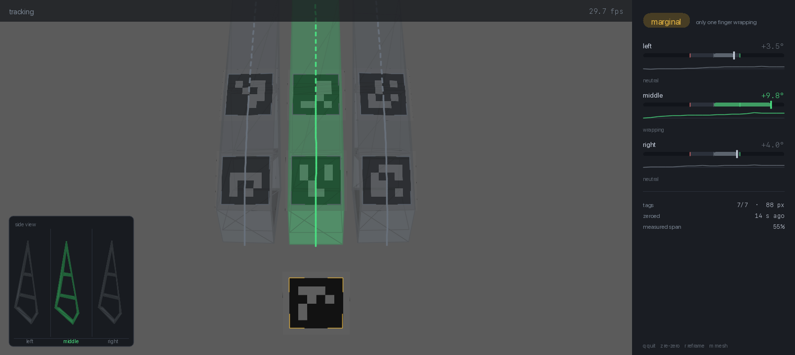

# FlexSense

A compliant, passive, 3D-printed hand that can feel what it is bracing against.

The fingers are flexures. They deform against whatever they press on, and
printed markers on them let a wrist camera read that deformation — **fully
passively**, with no strain gauges and no wiring in the hand. The live tool
turns that into a grip verdict: is each finger wrapping around the hold, or
bending the wrong way and about to slip?

Demo platform is a LeRobot SO-101 arm, but nothing here depends on the arm. It
needs a camera, a calibration, and a hand with markers on it.



## What you need

- Python 3.10+
- A USB camera on a rigid mount, roughly 140 mm from the fingertips
- The printed hand: 3 flexure fingers, plus the rigid cuff the reference marker
  sits on
- 7 printed markers (see below)

## Install

```bash
python -m venv .venv && ./.venv/bin/pip install -e .
```

Editable is the mode to use. Several defaults (`config/hand.yaml`,
`assets/finger_v2.stl`, `calibration/camera_intrinsics.json`) are files in this
folder, and an editable install keeps them reachable from any directory. A
plain `pip install .` would build a wheel without them.

Every command below is also runnable as `python -m flexsense ...` from this
folder, with no install at all.

## 1. Print the markers

```bash
flexsense markers --output markers.svg
```

These are **ArUco `DICT_4X4_50`**, not AprilTag. The two families look alike and
do not decode as each other, so print the sheet this command makes rather than
markers from anywhere else. The sheet is generated from `config/hand.yaml`, so
the ids on the paper always match the ids the tracker expects.

Print at **100% / actual size** — not "fit to page". Then measure one marker
with calipers. It must be 18.0 mm across the black square. Printers commonly
scale by a few percent, and marker size scales every millimetre and every
distance the system reports. If yours comes out different, put the measured
number in `tag_mm` in `config/hand.yaml`.

## 2. Stick them on

Camera's point of view, reference marker at the bottom on the cuff, fingers
extending upward away from it:

```
    [0]  [2]  [4]     <- farther from the cuff: tip
    [1]  [3]  [5]     <- closer to the cuff: base
         [11]         <- rigid reference, on the cuff
```

They go on the **narrow 20 mm side wall** of each finger, not on the wide face
of the truss. That is what `mesh.roll_deg: -90` in `config/hand.yaml` records —
the render needs to know which face carries the tags, and it cannot tell from
the CAD alone. If you mount them on the other face, the drawn finger will sit a
quarter turn out of true against the real one.

Markers must sit flat. A marker bridged across a bending section, or curled
over a domed surface, corrupts everything downstream — a bowed reference marker
corrupts all three fingers at once, not just one.

Marker 11 is the frame everything is measured against. If it is hidden or
glared out, that frame is unusable and the tool says so.

## 3. Calibrate the camera

**Do this on your own camera.** The `calibration/` file in this folder belongs
to the camera it was measured on, and reusing another one is the failure that
still looks like a working system while reporting wrong angles. Every run
prints which calibration it loaded and when it was made — read that line.

```bash
flexsense screen-calibrate --source 0
```

This shows an animated target on your screen and captures views of it; no
printing required, and it produced a better calibration than a printed board
did. It writes `calibration/camera_intrinsics.json`.

## 4. Run it

```bash
flexsense grip --source 0
```

Hold the fingers unloaded for the zeroing countdown, then grip something.
`--source` takes a camera index or a video file.
The controls are always shown in a dedicated bar below the calibrated camera
frame, so they do not cover marker pixels.

| key | |
|---|---|
| `q` | quit |
| `z` | re-zero (fingers unloaded) |
| `r` | re-fit the side view |
| `m` | toggle the 3D finger render |

Add `--no-mesh` for a plain text readout with no rendering.

To collect a local GOOD/BAD training dataset from the same calibrated view:

```bash
flexsense label --source 0 --dataset data/grip_labels
```

The labeling bar shows `G` to save GOOD, `B` to save BAD, `U` to undo the
latest sample, and the same re-zero/reframe/mesh/quit controls as the live
view. Each sample contains the untouched camera frame and the full FlexSense
assessment in `labels.jsonl`.

## Reading the display

**Camera pane.** The finger CAD is bent to the measured shape and drawn over
the real fingers, coloured by state. The line down each finger is its spine;
where it goes **dashed** you are past the outermost marker, so that stretch is
extrapolated rather than measured.

**Side view (bottom left).** Each finger seen from the side, in its own lane, on
one shared scale. This exists because from the wrist camera the fingers point
nearly down the lens, so bending is foreshortened into almost nothing. The side
view is where you can actually see it.

**Gauges.** Zero at the centre, wrapping to the right, back-bending to the left.
The two coloured ticks are the thresholds, so you can see how close a reading is
to changing class. Below each is a rolling trace — a slip shows up as a step.

**Verdict.** Any finger back-bending makes the verdict `bad`, regardless of the
others. That is deliberate: that finger is the one about to slip, and this is
not a majority vote.

## Tuning the thresholds

In `config/hand.yaml`:

```yaml
grip:
  wrap_deg: 6.0       # signed bend that counts as wrapping
  backbend_deg: 4.0   # signed bend that counts as back-bending
  wrap_sign: -1.0     # which sign means wrapping
```

`wrap_sign` depends on which face of the finger the markers are stuck to and
cannot be derived from geometry. It is calibrated for this hand. If a good grip
reads as `backbending`, flip it.

`wrap_deg` and `backbend_deg` are still guesses. Watch the gauges during a solid
hold, a marginal one and a slip, and move the thresholds to where the classes
actually separate. For scale: bend between the two markers runs about
**0.33° per mm of tip deflection**, so 6° is asking for roughly 18 mm of travel.

## Other commands

```bash
flexsense watch --source 0          # just show detections, with pixel sizes
flexsense hand-check                # validate hand.yaml and predict the optics
flexsense hand-preview              # render what the declared camera would see
flexsense hand-rehearse             # run the whole pipeline in simulation
flexsense camera-refit --frames-dir calibration/views_screen   # refit, no recapture
```

Tests: `python -m unittest discover -s tests`

## If it does not work

**"reference tag not visible"** — marker 11 is hidden, glared, or too small.
`flexsense watch` shows what is detected and how many pixels across.

**Markers detected but tiny.** Below about 50 px across, decoding gets
unreliable and accuracy falls apart; corner error is roughly 0.5 mm at 30 px
against 0.044 mm at 90 px. Move the camera closer or raise the resolution. This
dominates every other variable.

**"camera is WxH but the calibration is for WxH"** — the calibration belongs to
the resolution it was measured at. Recalibrate at the resolution you want.

**Angles look wrong but nothing errors.** Almost always the calibration is from
a different camera. Check the line printed at startup.

`CONTEXT.md` holds the design notes, the measured findings, and the open items.

## Verify the math without a camera

```bash
python -m unittest discover -s tests -v
```


## Simulate how the conforming finger deforms

`flexsense finray` presses a rigid object into the Fin Ray finger and reports what
the profile does. It exists to answer the question the tracker cannot: how much
deformation should we expect for a given grip force, and therefore how much
signal there is for the camera to measure.

```bash
python -m flexsense finray --material tpu95a --object cylinder --radius 15 \
    --station 55 --advance 16 --svg finger.svg --json finger.json
```

### Where the geometry comes from

The side view dimensions a 91 mm back member, an 86 mm front (contact) member,
1.5 mm walls, a 26.4 mm clear cavity at the base, and the clear height at each
of six ribs. It does not dimension the taper angle, so `FingerSpec.taper_angle`
solves it from the 26.4 mm base height. The reconstruction is then over
determined, which is what makes it checkable:

| quantity | model | drawing |
| --- | --- | --- |
| taper angle | 18.925 deg | not given |
| back member outer length | 91.00 mm | 91 mm |
| base face vs contact face | 89.84 deg | square |
| rib pitch, first five bays | 9.04 - 9.16 mm | uniform |

The 91 mm is the real check: it is never used in the solve, and it has to land
on the dimensioned value for the taper to be right. `tests/test_finray_geometry.py`
asserts it.

Two numbers a side view cannot give are the out-of-plane depth and the material,
and between them they move the answer by more than two orders of magnitude. Both
are `FingerSpec` fields; nothing downstream assumes a value.

### What the solver is

`flexsense/fem2d.py` is a co-rotational Euler-Bernoulli frame solver: small
strains, arbitrarily large rotations, Newton-Raphson with adaptive continuation.
Linear FEA is not enough here - the conforming behaviour is a large-deflection
effect and simply does not appear in the linear response.

It is checked against four benchmarks in `tests/test_fem2d.py`: the analytic
tangent against finite differences, stress-free large rigid-body motion,
`PL^3/3EI` at small deflection, the elastica at `PL^2/EI = 10`, and an end moment
of `2*pi*EI/L` rolling a cantilever into a closed circle.

### Reading the output

`tip_dy_mm` is the number to watch. It starts positive - the tip follows the
object, like any beam - then reverses and goes negative once the press is deep
enough. That reversal is the Fin Ray effect engaging, and `contact_patch_mm`
grows with it as the face stops touching at a point and starts wrapping.

### Elastomers: why there is a constitutive model at all

The printed finger is TPU 95A, and at the working point its walls reach about
**24% bending strain**. There is no Young's modulus that means anything over
that range, so `flexsense/materials.py` carries an incompressible Yeoh law and
`fem2d` integrates it over fibres through the wall instead of using EA and EI.
Passing a linear material through the same fibre path reproduces the closed-form
element to nine digits, which is what `tests/test_materials.py` checks first.

The result is less dramatic than the strain figure suggests, and the reason is
worth knowing:

| | force at 16 mm press |
| --- | --- |
| Hookean at E0 = 24.3 MPa | 8.07 N |
| full Yeoh TPU 95A | 7.86 N |
| Hookean at E0 = 17 MPa (relaxed) | 5.5 N |
| Hookean at E0 = 34 MPa (stiff print) | 11.0 N |

TPU softens 24% in tension at 20% strain but stiffens 37% in compression, and a
section in bending has both. They very nearly cancel: hyperelasticity moves the
grip force by **3.5%**, while the modulus value moves it by **40%**. The
deformed shape barely moves at all.

So the model is now limited by one number it cannot derive - and neither can a
datasheet, because printed TPU depends on nozzle temperature, layer orientation,
and how long the grip is held. Pull a printed strip and fit your own:

```python
from flexsense.materials import fit_yeoh
material = fit_yeoh(strain_samples, nominal_stress_mpa)   # 5+ points to ~50% strain
```

What the model still does not do is **viscoelasticity**. TPU stress-relaxes over
seconds to minutes, so a finger held at constant deflection loses grip force,
and a deformation-to-force calibration drifts with hold time. That is a larger
error than anything in the elastic model. Calibrate FlexSense at the hold time
you actually grip at, and treat the modulus band above as the honest uncertainty.
